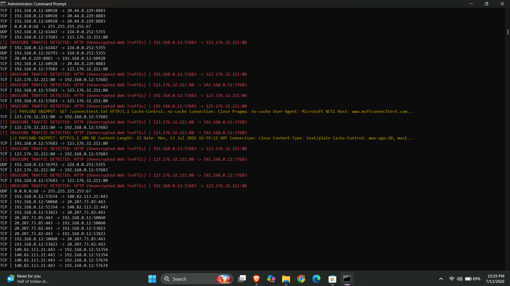
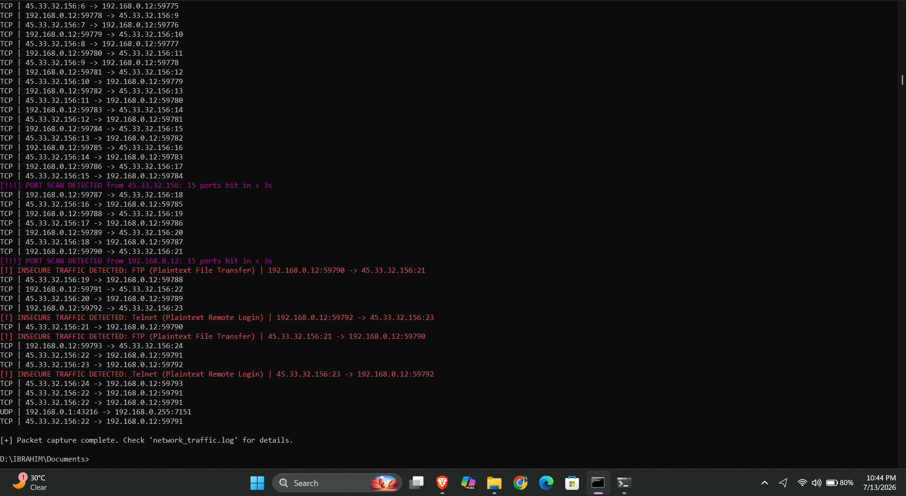

# 🛡️ Python Network Traffic Analyzer & IDS

A lightweight, real-time Network Traffic Analyzer and basic Intrusion Detection System (IDS) built with Python and Scapy.

This tool was developed to monitor network traffic, perform Deep Packet Inspection (DPI) to identify insecure plaintext protocols, and detect rapid port-scanning attacks in real-time.

## 🚀 Features

* **Real-Time Packet Sniffing:** Captures and analyzes TCP and UDP network traffic on the fly.
* **Intrusion Detection System (IDS):** Automatically detects and alerts on high-speed port scans (e.g., Nmap scans) targeting the host machine.
* **Insecure Protocol Alerting:** Flags traffic using unencrypted protocols like HTTP (Port 80), FTP (Port 21), and Telnet (Port 23) in bright red.
* **Deep Packet Inspection (Payload Extraction):** Extracts and displays raw plaintext payloads from unencrypted traffic (such as HTTP requests/responses) to demonstrate data exposure risks.
* **Persistent Logging:** Automatically logs all network events and critical alerts to `network_traffic.log` for post-incident analysis.

## 🛠️ Technologies Used

* **Language:** Python 3.x
* **Core Libraries:** `scapy` (packet manipulation), `argparse` (CLI), `logging` (event tracking)
* **UI/UX:** `colorama` (cross-platform terminal color support)

## 📋 Prerequisites

* Python 3.x installed.
* Administrative / Root privileges (required for raw socket access to capture packets).
* *(Windows Users Only)*: [Npcap](https://npcap.com/) must be installed (usually installed automatically with Wireshark).

## ⚙️ Installation

1. Clone the repository:
   ```bash
   git clone [https://github.com/ibrahimvol1/Network-Traffic-Analyzer-IDS.git](https://github.com/ibrahimvol1/Network-Traffic-Analyzer-IDS.git)
   cd Network-Traffic-Analyzer-IDS
   ```
2. Install the required Python packages:
    ```bash
   pip install scapy colorama
    ```
    
## 💻 Usage

Because this script reads raw network data, it must be run as an Administrator (Windows) or using sudo (Linux/macOS).

Basic Run (Default: 50 packets):
```bash
python traffic_analyzer.py
Continuous Capture (Infinite mode):
```

Continuous Capture (Infinite mode):
```bash
python traffic_analyzer.py -c 0
Specify a Network Interface:
```

Specify a Network Interface:
```bash
python traffic_analyzer.py -i eth0 -c 100
```

## 📸 Screenshots
### Deep Packet Inspection (HTTP Payload)



### Intrusion Detection (Rapid Port Scan)


## ⚠️ Disclaimer
This tool was created for educational purposes and personal cybersecurity training. It should only be used on networks and devices you explicitly own or have permission to monitor. Unauthorized network sniffing is illegal.
